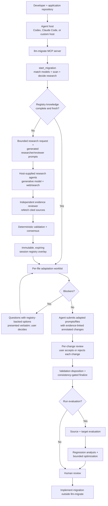

# llm-migrate

Migrate your LLM application to a new model, provider, or platform — for
example Anthropic Claude ↔ OpenAI GPT, or a direct API ↔ Amazon Bedrock — with
agent-assisted research, a reviewable migration plan, evidence-linked
adaptations you accept or reject change by change, and before/after
evaluation, all before changing production code.

[](https://github.com/Athenaxlee/llm-migrate/actions/workflows/ci.yml)

`llm-migrate` helps a developer or coding agent inspect an existing Python
application, research the source and target models, and decide exactly what a
safe migration requires — without editing any application file itself.

Use it when you are:

- upgrading to a newer model generation
- moving between providers, such as Anthropic and OpenAI
- moving between platforms, such as a direct API and Amazon Bedrock
- replacing a deprecated model
- comparing targets for capability, lifecycle, cost, or latency
- validating prompt, tool, structured-output, or invocation changes

The project is local-first and provider-neutral. It does not silently rewrite
application files, operate a hosted inference gateway, or promote researched
facts into the shared registry without review.

## Recommended way to use it

The primary experience is **an agent host connected to the `llm-migrate` MCP
server, driving one guided migration run**. Codex, Claude Code, or another
MCP-capable host supplies the generative models and web/search tools.
`llm-migrate` supplies the scanner, typed research stages, evidence gates,
session registry, migration planner, per-file adaptation worklist, per-change
review, and evaluation contracts.

One `start_migration` call creates a run workspace, matches both model
identifiers against the reviewed registry (tolerating vague spellings), scans
the application, decides whether research is needed and says why, and returns
ordered next steps. From there the run is a state machine — `get_run_status`
reports the position and the single next action at any point:

1. Optionally research missing or stale facts with host-supplied agents,
   independently review every consequential claim, and build an expiring,
   user-scoped session registry.
2. Work the per-file adaptation worklist: the agent writes adapted prompts
   and files and submits them with guidance dispositions and evidence-linked
   annotated changes; unaffected files close in one confirmation call.
3. If the plan has blockers, each becomes a question for you with
   registry-backed options; the agent presents them verbatim and records your
   decisions durably.
4. Review every annotated change like a pull request — accept or reject each
   one; rejections regenerate the deliverable deterministically.
5. Finalize, validate, and finalize again. The first finalize checks the
   whole deliverable set together and writes the manifest, the report (which
   opens with an "Action required" list), the change log, and a generated
   request-shape contract test. You run that test or a BYOK evaluation, the
   agent records the outcome, and a second finalize records the migration
   as validated.

If the canonical registry already has fresh coverage, the research request is
refused and the agent continues with the reviewed local knowledge. "Live
research by default" therefore means **always check and research when needed**,
not "browse even when verified facts already exist."

## Agentic workflow



The agent host makes generative calls and writes the adaptations. The MCP
server remains the deterministic control and validation layer: it derives
worklists, validates fail-closed, stores deliverables under the run's
`output/`, and never modifies the application tree.

## Prerequisites

For the recommended guided workflow:

- Python 3.11 or newer
- Git
- a local Python application repository
- an MCP-capable coding agent with a generative model — use the most capable
  reasoning model your host offers, with extended thinking enabled (for
  example an Opus- or Fable-class Claude model, or a GPT-5-class model at high
  reasoning effort). The agent researches, adapts prompts and files with
  evidence-linked annotations, and relays review decisions; small or fast
  tiers produce more rejected submissions and retries
- web/search access in that agent host (for research on demand)
- a separate agent or fresh isolated context for evidence review
- the source and target model identifiers as you know them — vague spellings
  are matched registry-first, and anything ambiguous returns candidates for
  you to confirm

Provider credentials are not needed for scanning, research validation,
planning, adaptation, or reporting. They are only needed when you explicitly
run source/target model evaluations. Amazon Bedrock evaluation also requires
the optional `aws` extra and your normal local AWS configuration.

## Installation

### Easiest: let your coding agent install it

If your coding agent can run shell commands and edit its own MCP configuration
(Claude Code, GitHub Copilot, Codex, Cursor, ...), paste this prompt and let it
do the setup:

```text
Install the llm-migrate MCP server for me:
1. git clone https://github.com/Athenaxlee/llm-migrate.git into a tools
   directory of your choice (tell me where), or reuse an existing checkout.
2. Inside the checkout, create a Python 3.11+ virtual environment at .venv and
   run: python -m pip install --upgrade pip && python -m pip install .
   (use '.[aws]' instead of '.' if I plan to run Amazon Bedrock evaluations).
3. Verify it works: .venv/bin/llm-migrate registry validate
   (on Windows: .venv\Scripts\llm-migrate registry validate).
4. Register the MCP server in THIS host's own MCP configuration, pointing the
   command at the absolute path of .venv/bin/llm-migrate-mcp
   (Windows: .venv\Scripts\llm-migrate-mcp.exe). Do not change any other
   configuration.
5. Show me the config change and the verification output, and tell me to
   restart/reload so the server is picked up.
```

For example, on Claude Code the registration step is:

```bash
claude mcp add llm-migrate -- /absolute/path/to/llm-migrate/.venv/bin/llm-migrate-mcp
```

### Manual install

```bash
git clone https://github.com/Athenaxlee/llm-migrate.git
cd llm-migrate

python3 -m venv .venv
source .venv/bin/activate
python -m pip install --upgrade pip
python -m pip install .
```

Windows PowerShell activation:

```powershell
.venv\Scripts\Activate.ps1
```

Optional Amazon Bedrock support:

```bash
python -m pip install '.[aws]'
```

Verify the installation:

```bash
llm-migrate registry validate
llm-migrate models list
```

### Updating an existing install

When this repository gets new commits and the MCP server is already installed,
update the same checkout in place. The MCP configuration keeps pointing at the
same `.venv` executable, so no configuration change is needed:

```bash
cd /path/to/llm-migrate              # the checkout your MCP config points at
git pull
.venv/bin/python -m pip install .    # Windows: .venv\Scripts\python -m pip install .
.venv/bin/pip show llm-migrate       # confirm the new version
.venv/bin/llm-migrate registry validate
```

Then restart or reload your MCP client (or just that server entry): hosts keep
the stdio server process running and will not pick up new code until the server
restarts. A development install (`pip install -e '.[dev]'`) only needs the
`git pull` and the restart.

Or paste this prompt and let your coding agent do it:

```text
Update my llm-migrate MCP server: find the checkout my MCP configuration points
at, run git pull there, reinstall it into that checkout's .venv with
"python -m pip install .", verify with "llm-migrate registry validate", and
show me the installed version from "pip show llm-migrate". Do not change the
MCP configuration unless the executable path actually moved. Then tell me to
restart/reload the MCP server so the update takes effect.
```

## Connect the MCP server

The installed stdio server is:

```bash
llm-migrate-mcp
```

**Each agent host keeps its own MCP registry.** Registering the server in one
host does not make it available in another — a server added to VS Code's
`mcp.json` serves GitHub Copilot there but is invisible to Claude Code, and vice
versa. Register it in every host you use, always pointing at the executable
inside the virtual environment:

| Host | How to register |
| --- | --- |
| Claude Code | `claude mcp add llm-migrate -- /absolute/path/to/llm-migrate/.venv/bin/llm-migrate-mcp` |
| VS Code (GitHub Copilot) | add the server to `.vscode/mcp.json` (workspace) or your user `mcp.json` |
| Codex and other hosts | add the server to that host's MCP configuration file |

A generic configuration block (the filename and wrapper syntax vary by host;
on Windows the executable is `.venv\Scripts\llm-migrate-mcp.exe`):

```json
{
  "mcpServers": {
    "llm-migrate": {
      "command": "/absolute/path/to/llm-migrate/.venv/bin/llm-migrate-mcp"
    }
  }
}
```

Verify in each host after restarting or reloading it: the host's tool list
should include `start_migration` (in Claude Code, `claude mcp list` shows the
server as connected). If the agent says it has no llm-migrate tools, the
server is registered in a different host — or the host was not restarted
after registration.

The agent host must provide its own generative model and web/search capability.
The `llm-migrate` MCP server does not contain an embedded model or general web
search tool, and it never calls an LLM API itself: research, prompt adaptation,
and review are done by your coding agent with its own model. Pick that model
accordingly (see Prerequisites): the guided workflow is demanding, and a
stronger reasoning model with extended thinking finishes it in fewer turns.

Hosts with tight inline-tool budgets can set the environment variable
`LLM_MIGRATE_TOOLSET=guided` on the server process to expose only the 23
guided-workflow tools; the default (`full`) exposes everything. Production
migrations can pass `strict=true` to `start_migration` (CLI
`run start --strict`) so unknown evidence, missing invocation facts,
incomplete coverage, consistency findings, and a missing validation
disposition block delivery instead of warning.

## First migration with an agent

Open the application repository in your MCP-capable agent and start the guided
run. A useful starting instruction is:

```text
Use the llm-migrate MCP tools to migrate this application.

Application: /absolute/path/to/application
Source: <platform> / <model id as you know it>
Target: <platform> / <model id as you know it>

Start with start_migration and follow its next_steps. When research is
recommended, run it without asking me, with non-interactive background
agents — it needs nothing from me. Ask me before finalizing. Present every
blocker question and review change to me verbatim — do not decide on my
behalf.
```

Research, when the registry's recorded facts are missing or past their
freshness window, runs one researcher and one independent reviewer agent per
scope. The generated prompts tell those agents to use web search and
page-fetch tools and never a visible browser, and the orchestration guidance
runs scopes in parallel, so the stage needs no attention from you. To skip it
for a quick pass, add `research="skip"` to `start_migration` (CLI
`--skip-research`).

For production migrations, add `strict=true`: unknown evidence URLs are
rejected, missing invocation facts and incomplete prompt coverage block, and
finalize refuses to complete cleanly over gaps, findings, undecided changes,
or a missing validation disposition.

The run workspace defaults to `<application>/.llm-migrate/runs/<run-id>/`
(pass `output_dir` to relocate it) and collects:

| Artifact | Purpose |
| --- | --- |
| `migration.yaml` | The run's durable identity: models, platforms, endpoints, and the selector-qualified invocation ids |
| `request.yaml` | Bounded research request, written only when knowledge is missing or stale, with the reasons |
| Research and review artifacts | Source-backed claims plus independent claim-level verdicts, validated in place |
| Session registry | Expiring, hash-linked, visibly non-canonical knowledge for this migration |
| `decisions.yaml` | Your recorded blocker decisions, re-applied on every plan regeneration |
| `output/prompts/`, `output/files/` | Validated adapted deliverables — the application tree is never modified |
| `changes.yaml` | Every submission's rationale, guidance dispositions, and annotated changes with evidence |
| `change-decisions.yaml` | Your per-change accept/reject decisions |
| `output/migration-manifest.yaml` | The machine-readable plan: changes, blockers, warnings, unknowns, tests, rollout |
| `output/migration-report.md` | Human-readable report with per-file changes, evidence, and the decision trail |
| `output/validation/test_target_invocation.py` | Generated request-shape contract test you wire up and run yourself |

Key behaviors during the run:

- Model identifiers are matched registry-first, tolerating Bedrock
  cross-region prefixes (`us.anthropic...`), version suffixes (`-v1:0`),
  spacing/typos, and loose platform names ("bedrock"). Where the reviewed
  registry says the target's bare model id is not invocable on demand (for
  example Claude on Bedrock), start returns the reviewed invocation selectors
  for you to confirm, and every later surface enforces the selector-qualified
  id.
- Every prompt task's `verbatim_source` is the unmodified original, never a
  proposed adaptation. Submissions must dispose every guidance item
  (applied / not applicable / declined with a note) and document every edit
  as an anchored, evidence-linked annotated change, reconciled against the
  real diff of the decoded runtime values — undocumented or phantom edits are
  rejected, new files need at least one evidence-linked annotation, and a
  file that genuinely needs no change is recorded with `unchanged=true`.
  Files that only import an SDK incidentally close through one
  `confirm_unaffected` call, and `submit_adaptations` batches submissions in
  one locked write.
- Blockers are never dead ends: each yields the question to ask you plus
  registry-backed options with consequences and evidence URLs — retarget,
  redesign, correction, or an explicit accept that requires your own
  rationale and is never a default. Decisions whose blocker disappears are
  reported stale, never silently applied.
- Finalize checks the whole effective deliverable set together: lingering
  source references (including reviewed aliases of the source model),
  forbidden bare target ids, mixed selectors, missing target attribution,
  and undisposed dropped couplings. It also sweeps every scanned application
  file: a file that still names the source model with no deliverable or
  recorded review is reported, whatever the scanner failed to trace. A
  mention you want to keep (documentation, history) is acknowledged with
  `confirm_unaffected(acknowledge_source_references=true)` and your own
  rationale.
- Validation must be evidenced: `generated_tests` needs your passing test
  result and its summary line, and `byok_evaluation` needs the evaluation
  run artifact bound to the current manifest. An evaluation of an older plan,
  or a record without evidence, is reported NOT VALIDATED.
- Prompt discovery survives real repository layouts: config paths written
  relative to the repository root resolve when you scan a subdirectory,
  Windows-style backslash values and case differences resolve, and simple
  `open(...).read()` / `Path(...).read_text()` loaders are traced. When
  prompt consumers exist but no prompt file resolved, `start_migration`
  lists the candidate files for you to confirm before writing anything; on a
  live run, `add_prompt_sources` and `confirm_prompt_consumer` fix discovery
  in place instead of forcing a new run.
- Unknowns give directions: each one says why it matters for your
  application, the exact next call (with the run directory filled in), and
  what closes it. Where the reviewed registry records conflicting evidence
  (for example whether adaptive thinking can be disabled on Bedrock), the run
  emits a small probe script under `output/probes/` for you to run with your
  own credentials; its printed result is recorded with `record_observation`
  for this run only and never changes the registry.
- Review has teeth: adapted pricing values are checked against the
  registry's facts unit-aware (per token / per 1K / per 1M) — a price that
  departs from the target's recorded price is flagged with its implied factor
  unless the change cites registry-recorded evidence, and leftover source
  pricing is flagged stale. A change that depends on a contested registry
  fact is marked CONTESTED in change review until an observation resolves
  it, and after the first finalize the run points you at a drafted
  evaluation instead of letting validation be skipped.
- Research runs by default and hands-free: when facts are missing or past
  their freshness window, `next_steps` and `get_run_status` tell the host to
  run the research stages now with non-interactive background agents (web
  search and page-fetch tools, never a visible browser), scopes in parallel,
  and to ask you first only if you asked to be consulted. A fresh registry
  (see "Keeping the registry fresh") means no research at all.
- Noise stays out of your way: prompt files referenced only by another
  model's configuration profile (or unreferenced next to selected siblings)
  are reported out of scope, unknowns the scan already answers are not
  raised, and registry guidance whose trigger (structured output, tool use,
  reasoning) your application never exhibits is pre-marked not applicable
  with the reason.

## MCP tool guide

The tools are grouped in the order an agent normally uses them. Most users
drive everything through the guided workflow group; the rest remain available
for manual composition.

### 1. Guided migration workflow (recommended)

| Tool | Use it when | What it does |
| --- | --- | --- |
| `start_migration` | Begin any migration | Matches both models registry-first, scans, decides whether research is needed, writes the run workspace, returns next steps |
| `get_run_status` | Any time | Reports the run's state-machine position and the single next action |
| `get_research_prompts` | The run recommends research | Returns scope-isolated researcher/reviewer prompt pairs with exact bounds, schemas, and artifact paths; the prompts demand non-interactive tools and the guidance runs scopes in parallel |
| `validate_research_artifact` | A research/review artifact is written | Validates the YAML in place with the deterministic gates |
| `build_session_registry` | All required scope artifacts validate | Finalizes the immutable, expiring session overlay |
| `list_adaptation_tasks` | The plan is ready | Derives the per-file worklist (snapshot-backed) with evidence-linked guidance and `unaffected_files` |
| `get_blocker_resolutions` / `record_blocker_decision` | The plan has blockers | Presents each blocker's question and registry-backed options; records your durable decision |
| `submit_adapted_prompt` / `submit_adapted_file` / `submit_adaptations` | The agent wrote adaptations | Validates fail-closed (dispositions, annotated changes, decoded-value diffs, selector enforcement) and stores deliverables; `submit_adaptations` batches |
| `confirm_unaffected` | Incidental-SDK files remain | Records reviewed no-change entries for them in one call |
| `scaffold_evaluation` | Status reports `validation_pending` after the first finalize | Drafts DRAFT evaluation cases from your application's own sample inputs and a suite bound to the current plan, for you to review and run |
| `record_observation` | You ran a probe or check for an open unknown | Records what the target actually did as a run-scoped observation that closes the unknown; the registry is never changed |
| `add_prompt_sources` / `confirm_prompt_consumer` | Status reports `discovery_incomplete` | Adds prompt files to the live run, confirms which file a dynamic consumer reads, or records your dismissal with its rationale; the worklist re-derives in place |
| `get_change_review` / `record_change_decision` / `record_change_decisions` | Deliverables await review | Presents each annotated change verbatim; your accept/reject regenerates the deliverable deterministically |
| `record_validation_disposition` | After the first finalize | Records how the migration was validated (a passing test result, or an evaluation run bound to the current manifest) |
| `finalize_migration` | Everything is decided | Runs the cross-surface consistency gate and writes the manifest, report, change log, and contract test |
| `resolve_model` / `get_model_profile` | Identity questions during the run | Registry-first resolution and full reviewed profiles |

### 2. Understand the application and models

| Tool | Use it when | What it does |
| --- | --- | --- |
| `scan_application` | Start any repository analysis | Scans a local Python application (and its YAML/JSON/TOML prompt configuration) into a normalized, source-located coupling inventory without executing it |
| `resolve_model` | You have a name, alias, or platform model ID | Resolves it to one canonical model and optional platform representation; ambiguity returns ranked candidates instead of guessing |
| `get_model_profile` | You need all reviewed facts for one known model | Returns the validated local registry profile and provenance |
| `check_model_lifecycle` | Deprecation or end-of-life may drive the migration | Interprets reviewed lifecycle facts at a selected date without live research |
| `compare_models` | Source and target are known | Reports `same`, `different`, `unsupported`, and `unknown` states across the migration surface, each claim evidence-linked |
| `recommend_models` | The target is not yet chosen | Hard-filters incompatible registry models, then ranks the remaining candidates against application requirements and goals |
| `query_live_pricing` | You explicitly want a current OpenRouter price observation | Fetches time-stamped third-party pricing evidence without changing canonical facts |
| `estimate_migration_cost` | You know the workload shape | Estimates recurring source and target token cost from checked-in canonical pricing |

Because the registry is intentionally small, `recommend_models` only ranks
models it knows. Use the research tools when the intended target is missing or
its migration-critical facts are stale.

### 3. Research missing or stale knowledge

| Tool | Use it when | What it does |
| --- | --- | --- |
| `create_migration_research_request` | Begin a researched workflow outside a guided run | Scans locally and creates a bounded request only for missing or stale topics; refuses unnecessary research |
| `validate_research_result` | A research agent has returned a typed artifact | Checks schema, scope, source policy, references, identities, and requested-topic boundaries before review |
| `validate_evidence_review` | An independent reviewer has returned verdicts | Confirms reviewer independence, research hash linkage, and claim coverage |
| `validate_research_artifact` | Artifacts live in a run workspace | Validates researcher/reviewer YAML in place by path and scope |
| `build_research_consensus` | Research and independent review both validate | Deterministically accepts or rejects claims; agent agreement alone is never evidence |
| `build_session_registry` | All required scope artifacts are present in the run workspace | Finalizes an immutable, expiring overlay; missing work or high-impact conflicts fail closed |
| `generate_session_migration_plan` | The target depends on session knowledge | Generates a plan over canonical plus explicitly selected session knowledge and exposes its trust and expiry |
| `propose_registry_update` | Researched facts should be considered for the shared registry | Produces a review-only canonical update proposal; it never edits or promotes registry files |

Live discovery happens in the **agent host**, not inside these tools. Research
agents receive the bounded request and use the host's generative model and
search tools. The reviewer must independently refetch cited sources. See the
[agent-host workflow](docs/agent-research-workflow.md) for the artifact protocol.

### 4. Prepare the migration (low-level)

| Tool | Use it when | What it does |
| --- | --- | --- |
| `analyze_prompt` | You need to understand one prompt's intent and assumptions | Conservatively identifies objectives, contracts, instructions, examples, grounding, reasoning, tool, and verbosity characteristics without inference |
| `prepare_prompt_migration` | You need a reviewable prompt candidate | Applies deterministic, registry-backed mappings and returns the candidate, semantic diff, risks, and validation guidance without rewriting the source file |
| `validate_prompt` | You want target-specific static checks | Checks context capacity, tool/output needs, reasoning instructions, and target platform compatibility |
| `analyze_invocation` | You need the SDK/request/tool/output coupling for an application | Normalizes provider operations, parameters, tool schemas, output contracts, streaming, reasoning controls, and multimodal payloads |
| `prepare_invocation_migration` | Source and target endpoints are known | Produces the target SDK, operation, model ID, parameters, tool/output candidates, configuration, warnings, and blockers without editing code |
| `generate_migration_plan` | Canonical registry knowledge is sufficient | Composes scanning, comparison, prompt/invocation preparation, validation, tests, and rollout into one application-level plan |
| `generate_migration_report` | A person needs to review the plan | Renders the integrated migration workflow as a readable Markdown report |

Prompt preparation itself does not call a generative model: the deterministic
candidate is the source prompt verbatim, with evidence-linked guidance. The
model-authored rewrite belongs to the agent host, and the guided workflow then
holds it to dispositions, annotations, and per-change review. That rewrite is
deliberately not a hidden core operation.

### 5. Evaluate and improve

| Tool | Use it when | What it does |
| --- | --- | --- |
| `generate_eval_suite` | You have a migration plan and representative cases | Binds one immutable evaluation corpus to the migration-manifest hash |
| `run_migration_eval` | Source and target endpoint configs are ready | Runs the same suite against both endpoints using user-owned credentials |
| `compare_outputs` | You need a deterministic comparison for one case | Compares paired results, including quality, latency, tokens, cost, refusal, errors, tools, and structured output |
| `analyze_regressions` | An evaluation run is complete | Produces a categorized regression report without inventing unsupported diagnoses |
| `optimize_migration` | You have regression evidence and optional candidate runs | Returns bounded, reproducible, review-only recommendations under quality, cost, latency, and run limits |

Endpoint configurations name credential environment variables; they never
contain credential values. Built-in execution supports direct OpenAI, direct
Anthropic, and Amazon Bedrock Converse. Other platforms require an executor
supplied by a Python host.

## Other interfaces

### CLI

Use the CLI for manual operation, automation, artifact inspection, or when an
agent host can read and write the stage YAML files but cannot call MCP
directly. The guided workflow is mirrored as `llm-migrate run
start|status|tasks|blockers|decide|submit-prompt|submit-file|
confirm-unaffected|record-validation|finalize|review|decide-change`, plus
`llm-migrate models match` and `llm-migrate research prompts`.

```bash
llm-migrate --help
llm-migrate run --help
llm-migrate research --help
llm-migrate plan --help
llm-migrate eval --help
```

The CLI and MCP server are thin interfaces over the same Python service.

### Headless Python

A Python host can implement `llm_migrate.core.orchestration.AgentRunner` and
call `MigrationService.run_agent_research(...)`. The host supplies agent calls;
the service still owns budgets, retries, resumability, artifacts, and gates.

### Agent workflow instructions

[`docs/agent-research-workflow.md`](docs/agent-research-workflow.md) is the
agent-neutral workflow used by Codex, Claude Code, or another host. It describes
how the host should run research and review. It is not a standalone model or
hosted service, and it is not packaged as a separate installed Codex or Claude
skill. The MCP server is the primary agent-facing product interface.

## Safety and trust

- Research agents receive exact identities and normalized requirements rather
  than the full repository whenever possible.
- Repository and webpage content is untrusted data and cannot change
  orchestration instructions, permissions, limits, or schemas.
- A researcher cannot review its own claims.
- Contradictory evidence remains unresolved; majority vote does not make it true.
- Session knowledge is hash-linked, expiring, user-scoped, and visibly
  `session_agent_reviewed` or `session_unreviewed`.
- Only a maintainer-reviewed proposal can change the canonical registry.
- Planning, preparation, and adaptation never rewrite application source
  files; deliverables live in the run workspace.
- The agent presents blocker questions, options, evidence, and review changes
  verbatim; the user decides, and an explicit accept requires the user's own
  rationale.
- Every edit in a deliverable is an anchored, evidence-linked annotated
  change reconciled against the real diff; serialization tricks cannot hide
  content from validation or make an unchanged deliverable look adapted.
- The generated contract test is emitted for you to run; the toolkit never
  executes your application, tests, or provider calls on its own.

```text
research -> evidence -> independent review -> session overlay -> migration plan
                                            \
                                             -> maintainer proposal -> canonical registry
```

## Current scope and limitations

| Area | Current behavior |
| --- | --- |
| Application scanning | Python-focused, plus structural YAML/JSON/TOML prompt-configuration discovery |
| Built-in registry | Intentionally small and evidence-backed; synthetic profiles are labeled `TEST/FIXTURE` |
| Prompt generation | Deterministic candidate preparation in core; model-authored rewrites belong to the agent host and face dispositions, annotations, and review |
| Source mutation | No automatic code or prompt rewriting |
| Dynamic inputs | Unresolved dynamic prompts or configuration remain explicit unknowns |
| Research agents | Supplied and paid for by the user's host |
| Agent orchestration | Sequential today; persistent caching and orchestrated arbitration are deferred |
| Network access | Explicit research/search in the host, live pricing, runtime evaluation, and cited-source refetching |
| Infrastructure | No hosted backend, telemetry, database, or project-owned credentials |

## Contributing

Contributions are welcome through reviewed pull requests. Start with
[CONTRIBUTING.md](CONTRIBUTING.md), follow the evidence requirements in
[the research policy](docs/research-policy.md) for registry work, and report
security issues privately through [SECURITY.md](SECURITY.md).

Project governance is documented in [GOVERNANCE.md](GOVERNANCE.md), and all
participants must follow the [Code of Conduct](CODE_OF_CONDUCT.md).

## Development

```bash
python -m pip install -e '.[dev]'
pytest
ruff check .
ruff format --check .
mypy
```

The repository registry is discovered automatically. To use another registry,
pass `--registry PATH` or set `LLM_MIGRATE_REGISTRY` to a root containing
`models/`.

### Keeping the registry fresh

Freshness windows are short by design (7 days for pricing and lifecycle, 14
for availability, 30 for capabilities and prompt guidance). Maintainers keep
them honest with a refetch-only refresh that never edits `registry/`:

```bash
llm-migrate registry refresh-evidence --model claude-sonnet-5
```

It refetches only the source URLs already recorded in the profile, hashes
each page's visible text against the baseline in
`.registry-proposals/<model>/refresh-evidence.yaml`, and reports: unchanged
pages that still name the model propose moving `checked_at` for the
categories they support; a page that no longer names the model (a lineup page
that dropped a legacy model) vouches for nothing; changed pages are held
until you re-verify them (then `--rebaseline`); a URL with no baseline gets
one recorded and proposes nothing; a category the bundle's review put on
hold stays held. Promote an approved proposal by hand through the model's
bundle, like every other registry change. `--no-record` produces a read-only report; `--output DIR` writes it
as YAML and Markdown.

Design references:

- [Project context](docs/project_context.md)
- [Architecture](docs/architecture.md)
- [Research policy](docs/research-policy.md)
- [Development phases](docs/project_phases.md)
- [Adaptation review](docs/adaptation-review.md)

## License

Copyright © 2026 Athena Li.

Licensed under the Apache License, Version 2.0. See [LICENSE](LICENSE).
