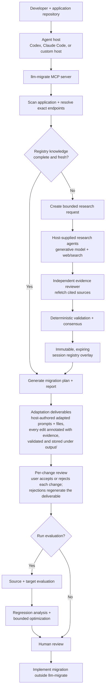

# llm-migrate

Migrate your LLM application to a new model, provider, or platform — for
example Anthropic Claude ↔ OpenAI GPT, or a direct API ↔ Amazon Bedrock — with
agent-assisted research, a reviewable migration plan, and before/after
evaluation, all before changing production code.

[](https://github.com/Athenaxlee/llm-migrate/actions/workflows/ci.yml)

`llm-migrate` helps a developer or coding agent inspect an existing Python
application, research the source and target models, and decide exactly what a
safe migration requires — without editing any application file itself.

Use it when you are:

- upgrading to a newer model generation
- moving between providers, such as Anthropic and OpenAI
- moving between platforms, such as a direct API and Amazon Bedrock
- replacing a deprecated model
- comparing targets for capability, lifecycle, cost, or latency
- validating prompt, tool, structured-output, or invocation changes

The project is local-first and provider-neutral. It does not silently rewrite
application files, operate a hosted inference gateway, or promote researched
facts into the shared registry without review.

## Recommended way to use it

The primary experience is **an agent host connected to the `llm-migrate` MCP
server**. Codex, Claude Code, or another MCP-capable host supplies the generative
models and web/search tools. `llm-migrate` supplies the scanner, typed research
stages, evidence gates, session registry, migration planner, and evaluation
contracts.

The built-in registry is deliberately small, so the recommended workflow is
**research on demand**:

1. Scan the application and identify the exact source and target.
2. Check the reviewed registry.
3. If required facts are missing or stale, research them with host-supplied
   agents and search tools.
4. Independently review every consequential claim.
5. Build an expiring, user-scoped session registry.
6. Generate the migration plan and report.
7. Optionally run source/target evaluations and regression analysis.
8. Review the artifacts before implementing changes.

If the canonical registry already has fresh coverage, the research request is
refused and the agent continues with the reviewed local knowledge. “Live
research by default” therefore means **always check and research when needed**,
not “browse even when verified facts already exist.”

Since V1.2, one guided entry point drives this whole flow: `start_migration`
matches both models registry-first (tolerating vague or platform-decorated
identifiers, and returning candidates for user confirmation instead of
guessing), scans the application, reports whether research would help and why,
creates a per-run workspace at `<application>/.llm-migrate/runs/<run-id>/`,
and returns ordered next steps. The run collects **adaptation deliverables** —
host-authored, deterministically validated adapted prompts and complete
adapted application files stored under the run's `output/` directory — and a
final report explaining what changed in each file and why. The application
tree itself is never modified.

## Agentic workflow



The agent host makes generative calls. The MCP server remains the deterministic
control and validation layer.

## Prerequisites

For the recommended live-research workflow:

- Python 3.11 or newer
- Git
- a local Python application repository
- an MCP-capable coding agent with a generative model
- web/search access in that agent host
- a separate agent or fresh isolated context for evidence review
- exact source and target provider, platform, model, and endpoint identifiers

Provider credentials are not needed for scanning, research validation, planning,
or reporting. They are only needed when you explicitly run source/target model
evaluations. Amazon Bedrock evaluation also requires the optional `aws` extra
and your normal local AWS configuration.

## Installation

### Easiest: let your coding agent install it

If your coding agent can run shell commands and edit its own MCP configuration
(Claude Code, GitHub Copilot, Codex, Cursor, ...), paste this prompt and let it
do the setup:

```text
Install the llm-migrate MCP server for me:
1. git clone https://github.com/Athenaxlee/llm-migrate.git into a tools
   directory of your choice (tell me where), or reuse an existing checkout.
2. Inside the checkout, create a Python 3.11+ virtual environment at .venv and
   run: python -m pip install --upgrade pip && python -m pip install .
   (use '.[aws]' instead of '.' if I plan to run Amazon Bedrock evaluations).
3. Verify it works: .venv/bin/llm-migrate registry validate
   (on Windows: .venv\Scripts\llm-migrate registry validate).
4. Register the MCP server in THIS host's own MCP configuration, pointing the
   command at the absolute path of .venv/bin/llm-migrate-mcp
   (Windows: .venv\Scripts\llm-migrate-mcp.exe). Do not change any other
   configuration.
5. Show me the config change and the verification output, and tell me to
   restart/reload so the server is picked up.
```

For example, on Claude Code the registration step is:

```bash
claude mcp add llm-migrate -- /absolute/path/to/llm-migrate/.venv/bin/llm-migrate-mcp
```

### Manual install

```bash
git clone https://github.com/Athenaxlee/llm-migrate.git
cd llm-migrate

python3 -m venv .venv
source .venv/bin/activate
python -m pip install --upgrade pip
python -m pip install .
```

Windows PowerShell activation:

```powershell
.venv\Scripts\Activate.ps1
```

Optional Amazon Bedrock support:

```bash
python -m pip install '.[aws]'
```

Verify the installation:

```bash
llm-migrate registry validate
llm-migrate models list
```

### Updating an existing install

When this repository gets new commits and the MCP server is already installed,
update the same checkout in place. The MCP configuration keeps pointing at the
same `.venv` executable, so no configuration change is needed:

```bash
cd /path/to/llm-migrate              # the checkout your MCP config points at
git pull
.venv/bin/python -m pip install .    # Windows: .venv\Scripts\python -m pip install .
.venv/bin/pip show llm-migrate       # confirm the new version
.venv/bin/llm-migrate registry validate
```

Then restart or reload your MCP client (or just that server entry): hosts keep
the stdio server process running and will not pick up new code until the server
restarts. A development install (`pip install -e '.[dev]'`) only needs the
`git pull` and the restart.

Or paste this prompt and let your coding agent do it:

```text
Update my llm-migrate MCP server: find the checkout my MCP configuration points
at, run git pull there, reinstall it into that checkout's .venv with
"python -m pip install .", verify with "llm-migrate registry validate", and
show me the installed version from "pip show llm-migrate". Do not change the
MCP configuration unless the executable path actually moved. Then tell me to
restart/reload the MCP server so the update takes effect.
```

## Connect the MCP server

The installed stdio server is:

```bash
llm-migrate-mcp
```

Point your MCP client to the executable inside the virtual environment. This is
a generic example; the configuration filename and wrapper syntax vary by host.

```json
{
  "mcpServers": {
    "llm-migrate": {
      "command": "/absolute/path/to/llm-migrate/.venv/bin/llm-migrate-mcp"
    }
  }
}
```

The agent host must provide its own generative model and web/search capability.
The `llm-migrate` MCP server does not contain an embedded model or general web
search tool.

Hosts with tight inline-tool budgets can set the environment variable
`LLM_MIGRATE_TOOLSET=guided` on the server process to expose only the
guided-workflow tools; the default (`full`) exposes everything. Production
migrations can pass `strict=true` to `start_migration` (CLI
`run start --strict`) so unknown evidence, missing invocation facts,
incomplete coverage, consistency findings, and a missing validation
disposition block delivery instead of warning.

## First migration with an agent

Open the application repository in your MCP-capable agent and give it exact
endpoint context. A useful starting instruction is:

```text
Use the llm-migrate MCP tools to migrate this application.

Application: /absolute/path/to/application
Source: <platform> / <model id as you know it>
Target: <platform> / <model id as you know it>

Start with start_migration and follow its next_steps. If a model needs
confirmation, ask me instead of guessing or researching it. Ask me before
running research and before finalizing. Research uses the prompts from
get_research_prompts with an independent reviewer that did not produce the
research. If the plan reports blockers, show me each blocker's question,
options, and evidence verbatim (get_blocker_resolutions), one at a time, and
record my answers with record_blocker_decision — never decide for me. Submit
every adapted prompt and adapted file through the submit_adapted_* tools,
documenting every edit as an annotated change with its evidence and disposing
every guidance item; never edit application source files directly. After
finalizing, walk me through each annotated change with get_change_review —
why, evidence, before/after — and record my accept or reject with
record_change_decision, one change at a time.
```

Model identifiers may be vague: regional Bedrock inference-profile prefixes
(`us.anthropic...`), version suffixes (`-v1:0`), spacing/typos, and loose
platform names ("bedrock") are matched deterministically against the registry,
and anything uncertain comes back as ranked candidates for you to confirm.

The expected outputs, collected under `<application>/.llm-migrate/runs/<run-id>/`
(or an explicit `output_dir`), are:

| Artifact | Purpose |
| --- | --- |
| Application analysis | Source-located inventory of model, SDK, prompt, parameter, tool, output, and platform coupling |
| Research request | Exact identities, required topics, date, source policy, and execution limits |
| Research and review artifacts | Source-backed claims plus independent claim-level verdicts |
| Session registry | Expiring, hash-linked, visibly non-canonical knowledge for this migration |
| Adapted prompts (`output/prompts/`) | Host-authored prompt rewrites for the target model, statically validated |
| Adapted files (`output/files/`) | Complete post-adaptation application files behind fail-closed checks |
| Change log (`output/changes.yaml`) | Per-file annotated changes (anchored spans, why, evidence), guidance dispositions, hashes, and validation state |
| Blocker decisions (`decisions.yaml`) | Durable record of every user decision on a blocker (option, rationale, date), re-applied on each plan regeneration |
| Change decisions (`change-decisions.yaml`) | Durable record of every accept/reject on an annotated change, keyed to the submitted content; rejections deterministically regenerate the deliverable |
| Migration manifest | Required changes, blockers, warnings, unknowns, tests, and rollout guidance |
| Migration report | Human-readable rendering including per-file adaptation changes, rationale, coverage gaps, and the blocker Decisions section |
| Regression report | Optional observed source/target behavior differences |

## MCP tool guide

The tools are grouped in the order an agent normally uses them. Most users do
not call every tool for every migration.

### 0. Guided workflow (recommended)

These V1.2 tools drive a complete migration through one run workspace and
produce reviewable adaptation deliverables; the lower-level stages below remain
available for manual or partial use.

| Tool | Use it when | What it does |
| --- | --- | --- |
| `start_migration` | Begin any full migration | Matches both models registry-first (candidates for confirmation instead of hard failures), scans the application, reports whether research is needed and why, creates the run workspace, and returns ordered next steps |
| `get_research_prompts` | The run recommends research and the user agrees | Renders one bounded, scope-isolated researcher and reviewer prompt pair per remaining scope from `request.yaml`, with per-scope status so completed stages are never re-run |
| `validate_research_artifact` | A researcher or reviewer wrote its YAML artifact | Reads `research/<scope>.yaml` (and `review/<scope>.yaml` when present) directly from the run workspace and runs the deterministic scope/policy and review-integrity gates — no artifact resends through the payload |
| `list_adaptation_tasks` | The plan (canonical or session-backed) is ready | Derives the per-file worklist: prompts to rewrite with guidance and risks, and files to adapt with their required changes |
| `get_blocker_resolutions` | The worklist reports blockers | Returns, per blocker, the question to ask the user plus 2–5 registry-backed options (retarget to a capable endpoint or model, an evidence-linked redesign task, an exact source correction, or an explicit accept) with consequences and evidence URLs — the agent presents them verbatim and never chooses |
| `record_blocker_decision` | The user has chosen an option | Records the decision durably in the run's `decisions.yaml` (accepts require the user's own rationale); retarget/correction decisions update the run identity registry-first, redesign decisions inject the required evidence-linked task, and stale decisions are reported, never silently applied |
| `submit_adapted_prompt` | The host has written an improved target-model prompt | Statically validates it against the target and stores it under `output/prompts/`; every guidance item must be disposed (applied / not applicable / declined with a note) and every edit documented as an anchored, evidence-linked annotated change reconciled against the real diff of the decoded runtime values — undocumented or phantom edits are rejected, and `unchanged=true` records an explicitly reported no-change deliverable |
| `submit_adapted_file` | The host has written one complete adapted application file | Applies fail-closed checks (path containment, Python syntax, actually changed, model-id consistency) plus the same disposition and annotated-change reconciliation, and stores it under `output/files/` |
| `submit_adaptations` | Several deliverables are ready at once | Validates every item independently (per-item accept/reject, never all-or-nothing) and applies the accepted subset in one locked, atomic write to `changes.yaml` |
| `confirm_unaffected` | The worklist lists `unaffected_files` (incidental SDK imports only) | Closes them all in one call, recording a reviewed no-change entry per file through the same unchanged guards |
| `get_run_status` | Any time between steps | Reports the run's state machine position (research → blockers → tasks → review → ready_to_finalize) with the single next action, served from the worklist snapshot so it is cheap |
| `finalize_migration` | Submissions are done (re-runnable any time) | Writes `migration-manifest.yaml`, `changes.yaml`, and `migration-report.md` with per-file annotated changes and their evidence, explicit no-change deliverables, coverage gaps, and changes awaiting review decisions |
| `get_change_review` | Submissions are in and the user reviews them | Returns, per deliverable, the decoded unified diff plus every annotated change with its why, evidence, before/after spans, and decision status — presented verbatim, one change at a time, like reviewing a pull request |
| `record_change_decision` | The user accepted or rejected one change | Records the decision durably in `change-decisions.yaml` (keyed to the submitted content; a resubmission makes it stale, never silently applied) and deterministically regenerates the deliverable — rejected regions revert, everything else keeps the submission |
| `record_change_decisions` | The user decided several changes at once | Records them in order with per-decision results; a refused decision is reported and the rest continue |
| `record_validation_disposition` | The migration was validated (or explicitly accepted without validation) | Durably records the method — BYOK evaluation, the user-executed generated contract test under `output/validation/`, or an explicit accept requiring the user's own rationale |

### 1. Understand the application and models

| Tool | Use it when | What it does |
| --- | --- | --- |
| `scan_application` | Start any repository migration | Scans a local Python application into a normalized, source-located coupling inventory without executing it |
| `resolve_model` | You have a name, alias, or platform model ID — even a vague one | Matches it registry-first, deterministically normalizing regional inference-profile prefixes, version suffixes, and loose platform names; returns `resolved`, `needs_confirmation` with ranked candidates, or `not_found` instead of failing hard |
| `get_model_profile` | You need all reviewed facts for one known model | Returns the validated local registry profile and provenance |
| `check_model_lifecycle` | Deprecation or end-of-life may drive the migration | Interprets reviewed lifecycle facts at a selected date without live research |
| `compare_models` | Source and target are known | Reports `same`, `different`, `unsupported`, and `unknown` states across the migration surface |
| `recommend_models` | The target is not yet chosen | Hard-filters incompatible registry models, then ranks the remaining candidates against application requirements and goals |
| `query_live_pricing` | You explicitly want a current OpenRouter price observation | Fetches time-stamped third-party pricing evidence without changing canonical facts |
| `estimate_migration_cost` | You know the workload shape | Estimates recurring source and target token cost from checked-in canonical pricing |

Because the registry is intentionally small, `recommend_models` only ranks
models it knows. Use the research tools when the intended target is missing or
its migration-critical facts are stale.

### 2. Research missing or stale knowledge

| Tool | Use it when | What it does |
| --- | --- | --- |
| `create_migration_research_request` | Begin the recommended researched workflow | Scans locally and creates a bounded request only for missing or stale topics; refuses unnecessary research |
| `validate_research_result` | A research agent has returned a typed artifact | Checks schema, scope, source policy, references, identities, and requested-topic boundaries before review |
| `validate_evidence_review` | An independent reviewer has returned verdicts | Confirms reviewer independence, research hash linkage, and claim coverage |
| `build_research_consensus` | Research and independent review both validate | Deterministically accepts or rejects claims; agent agreement alone is never evidence |
| `build_session_registry` | All required scope artifacts are present in the run workspace | Finalizes an immutable, expiring overlay; missing work or high-impact conflicts fail closed |
| `generate_session_migration_plan` | The target depends on session knowledge | Generates a plan over canonical plus explicitly selected session knowledge and exposes its trust and expiry |
| `propose_registry_update` | Researched facts should be considered for the shared registry | Produces a review-only canonical update proposal; it never edits or promotes registry files |

Live discovery happens in the **agent host**, not inside these tools. Research
agents receive the bounded request and use the host’s generative model and
search tools. The reviewer must independently refetch cited sources. Do not
hand-write the agent assignments: `get_research_prompts` renders them from the
request, scope-isolated so agents never collide or redo completed stages. See
the [agent-host workflow](docs/agent-research-workflow.md) for the artifact
protocol.

### 3. Prepare the migration

| Tool | Use it when | What it does |
| --- | --- | --- |
| `analyze_prompt` | You need to understand one prompt’s intent and assumptions | Conservatively identifies objectives, contracts, instructions, examples, grounding, reasoning, tool, and verbosity characteristics without inference |
| `prepare_prompt_migration` | You need a reviewable prompt candidate | Applies deterministic, registry-backed mappings and returns the candidate, semantic diff, risks, and validation guidance without rewriting the source file |
| `validate_prompt` | You want target-specific static checks | Checks context capacity, tool/output needs, reasoning instructions, and target platform compatibility |
| `analyze_invocation` | You need the SDK/request/tool/output coupling for an application | Normalizes provider operations, parameters, tool schemas, output contracts, streaming, reasoning controls, and multimodal payloads |
| `prepare_invocation_migration` | Source and target endpoints are known | Produces the target SDK, operation, model ID, parameters, tool/output candidates, configuration, warnings, and blockers without editing code |
| `generate_migration_plan` | Canonical registry knowledge is sufficient | Composes scanning, comparison, prompt/invocation preparation, validation, tests, and rollout into one application-level plan |
| `generate_migration_report` | A person needs to review the plan | Renders the integrated migration workflow as a readable Markdown report |

Prompt preparation itself does not call a generative model. For a substantial
model-authored rewrite, the agent host writes it from the plan and the
deterministic candidate, then submits it through `submit_adapted_prompt` so it
is validated, stored under the run's `output/prompts/`, and explained in the
final report. The rewrite is deliberately not a hidden core operation.

### 4. Evaluate and improve

| Tool | Use it when | What it does |
| --- | --- | --- |
| `generate_eval_suite` | You have a migration plan and representative cases | Binds one immutable evaluation corpus to the migration-manifest hash |
| `run_migration_eval` | Source and target endpoint configs are ready | Runs the same suite against both endpoints using user-owned credentials |
| `compare_outputs` | You need a deterministic comparison for one case | Compares paired results, including quality, latency, tokens, cost, refusal, errors, tools, and structured output |
| `analyze_regressions` | An evaluation run is complete | Produces a categorized regression report without inventing unsupported diagnoses |
| `optimize_migration` | You have regression evidence and optional candidate runs | Returns bounded, reproducible, review-only recommendations under quality, cost, latency, and run limits |

Endpoint configurations name credential environment variables; they never
contain credential values. Built-in execution supports direct OpenAI, direct
Anthropic, and Amazon Bedrock Converse. Other platforms require an executor
supplied by a Python host.

## Other interfaces

### CLI

Use the CLI for manual operation, automation, artifact inspection, or when an
agent host can read and write the stage YAML files but cannot call MCP directly.

```bash
llm-migrate --help
llm-migrate run --help        # guided runs: start, tasks, blockers, decide, submit-*, finalize, review, decide-change
llm-migrate models match --help
llm-migrate research --help   # includes `research prompts`
llm-migrate plan --help
llm-migrate eval --help
```

The CLI and MCP server are thin interfaces over the same Python service.

### Headless Python

A Python host can implement `llm_migrate.core.orchestration.AgentRunner` and
call `MigrationService.run_agent_research(...)`. The host supplies agent calls;
the service still owns budgets, retries, resumability, artifacts, and gates.

### Agent workflow instructions

[`docs/agent-research-workflow.md`](docs/agent-research-workflow.md) is the
agent-neutral workflow used by Codex, Claude Code, or another host. It describes
how the host should run research and review. It is not a standalone model or
hosted service, and it is not packaged as a separate installed Codex or Claude
skill. The MCP server is the primary agent-facing product interface.

## Safety and trust

- Research agents receive exact identities and normalized requirements rather
  than the full repository whenever possible.
- Repository and webpage content is untrusted data and cannot change
  orchestration instructions, permissions, limits, or schemas.
- A researcher cannot review its own claims.
- Contradictory evidence remains unresolved; majority vote does not make it true.
- Session knowledge is hash-linked, expiring, user-scoped, and visibly
  `session_agent_reviewed` or `session_unreviewed`.
- Only a maintainer-reviewed proposal can change the canonical registry.
- Planning and preparation never rewrite application source files.
- Every edit in an adaptation deliverable is annotated with its evidence and
  reconciled against the real diff; the user accepts or rejects each change,
  and deliverables stay clean of explanatory comments.

```text
research -> evidence -> independent review -> session overlay -> migration plan
                                            \
                                             -> maintainer proposal -> canonical registry
```

## Current scope and limitations

| Area | Current behavior |
| --- | --- |
| Application scanning | Python-focused |
| Built-in registry | Intentionally small and evidence-backed; synthetic profiles are labeled `TEST/FIXTURE` |
| Prompt generation | Deterministic candidate preparation in core; model-authored rewrites belong to the agent host and are validated and stored as run deliverables |
| Source mutation | No automatic code or prompt rewriting; adapted files are review candidates under the run's `output/` directory |
| Dynamic inputs | Unresolved dynamic prompts or configuration remain explicit unknowns |
| Research agents | Supplied and paid for by the user’s host |
| Agent orchestration | Sequential today; persistent caching and orchestrated arbitration are deferred |
| Network access | Explicit research/search in the host, live pricing, runtime evaluation, and cited-source refetching |
| Infrastructure | No hosted backend, telemetry, database, or project-owned credentials |

## Contributing

Contributions are welcome through reviewed pull requests. Start with
[CONTRIBUTING.md](CONTRIBUTING.md), follow the evidence requirements in
[the research policy](docs/research-policy.md) for registry work, and report
security issues privately through [SECURITY.md](SECURITY.md).

Project governance is documented in [GOVERNANCE.md](GOVERNANCE.md), and all
participants must follow the [Code of Conduct](CODE_OF_CONDUCT.md).

## Development

```bash
python -m pip install -e '.[dev]'
pytest
ruff check .
ruff format --check .
mypy
```

The repository registry is discovered automatically. To use another registry,
pass `--registry PATH` or set `LLM_MIGRATE_REGISTRY` to a root containing
`models/`.

Design references:

- [Project context](docs/project_context.md)
- [Architecture](docs/architecture.md)
- [Research policy](docs/research-policy.md)
- [Development phases](docs/project_phases.md)

## License

Copyright © 2026 Athena Li.

Licensed under the Apache License, Version 2.0. See [LICENSE](LICENSE).
