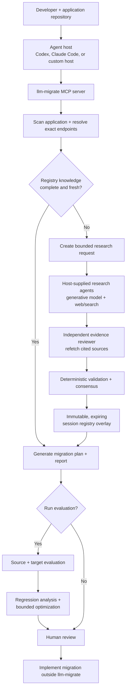

# llm-migrate

Agent-assisted planning and evaluation for LLM application migrations.

[](https://github.com/Athenaxlee/llm-migrate/actions/workflows/ci.yml)

`llm-migrate` helps a developer or coding agent inspect an existing Python
application, research the source and target models, and produce a reviewable
migration plan before anyone changes production code.

Use it when you are:

- upgrading to a newer model generation
- moving between providers, such as Anthropic and OpenAI
- moving between platforms, such as a direct API and Amazon Bedrock
- replacing a deprecated model
- comparing targets for capability, lifecycle, cost, or latency
- validating prompt, tool, structured-output, or invocation changes

The project is local-first and provider-neutral. It does not silently rewrite
application files, operate a hosted inference gateway, or promote researched
facts into the shared registry without review.

## Recommended way to use it

The primary experience is **an agent host connected to the `llm-migrate` MCP
server**. Codex, Claude Code, or another MCP-capable host supplies the generative
models and web/search tools. `llm-migrate` supplies the scanner, typed research
stages, evidence gates, session registry, migration planner, and evaluation
contracts.

The built-in registry is deliberately small, so the recommended workflow is
**research on demand**:

1. Scan the application and identify the exact source and target.
2. Check the reviewed registry.
3. If required facts are missing or stale, research them with host-supplied
   agents and search tools.
4. Independently review every consequential claim.
5. Build an expiring, user-scoped session registry.
6. Generate the migration plan and report.
7. Optionally run source/target evaluations and regression analysis.
8. Review the artifacts before implementing changes.

If the canonical registry already has fresh coverage, the research request is
refused and the agent continues with the reviewed local knowledge. “Live
research by default” therefore means **always check and research when needed**,
not “browse even when verified facts already exist.”

## Agentic workflow



The agent host makes generative calls. The MCP server remains the deterministic
control and validation layer.

## Prerequisites

For the recommended live-research workflow:

- Python 3.11 or newer
- Git
- a local Python application repository
- an MCP-capable coding agent with a generative model
- web/search access in that agent host
- a separate agent or fresh isolated context for evidence review
- exact source and target provider, platform, model, and endpoint identifiers

Provider credentials are not needed for scanning, research validation, planning,
or reporting. They are only needed when you explicitly run source/target model
evaluations. Amazon Bedrock evaluation also requires the optional `aws` extra
and your normal local AWS configuration.

## Installation

```bash
git clone https://github.com/Athenaxlee/llm-migrate.git
cd llm-migrate

python3 -m venv .venv
source .venv/bin/activate
python -m pip install --upgrade pip
python -m pip install .
```

Windows PowerShell activation:

```powershell
.venv\Scripts\Activate.ps1
```

Optional Amazon Bedrock support:

```bash
python -m pip install '.[aws]'
```

Verify the installation:

```bash
llm-migrate registry validate
llm-migrate models list
```

## Connect the MCP server

The installed stdio server is:

```bash
llm-migrate-mcp
```

Point your MCP client to the executable inside the virtual environment. This is
a generic example; the configuration filename and wrapper syntax vary by host.

```json
{
  "mcpServers": {
    "llm-migrate": {
      "command": "/absolute/path/to/llm-migrate/.venv/bin/llm-migrate-mcp"
    }
  }
}
```

The agent host must provide its own generative model and web/search capability.
The `llm-migrate` MCP server does not contain an embedded model or general web
search tool.

## First migration with an agent

Open the application repository in your MCP-capable agent and give it exact
endpoint context. A useful starting instruction is:

```text
Use the llm-migrate MCP tools to plan this migration.

Application: /absolute/path/to/application
Source: <provider> / <platform> / <model> / <endpoint>
Target: <provider> / <platform> / <model> / <endpoint>

Treat research-on-demand as the default. Check the reviewed registry first. If
migration-critical facts are missing or stale, follow
docs/agent-research-workflow.md, use authoritative sources, and use an
independent reviewer that did not produce the research. Build a session overlay,
then generate a migration plan and report. Do not edit application source files.
```

The expected outputs are:

| Artifact | Purpose |
| --- | --- |
| Application analysis | Source-located inventory of model, SDK, prompt, parameter, tool, output, and platform coupling |
| Research request | Exact identities, required topics, date, source policy, and execution limits |
| Research and review artifacts | Source-backed claims plus independent claim-level verdicts |
| Session registry | Expiring, hash-linked, visibly non-canonical knowledge for this migration |
| Migration manifest | Required changes, blockers, warnings, unknowns, tests, and rollout guidance |
| Migration report | Human-readable rendering for engineering review |
| Regression report | Optional observed source/target behavior differences |

## MCP tool guide

The tools are grouped in the order an agent normally uses them. Most users do
not call every tool for every migration.

### 1. Understand the application and models

| Tool | Use it when | What it does |
| --- | --- | --- |
| `scan_application` | Start any repository migration | Scans a local Python application into a normalized, source-located coupling inventory without executing it |
| `resolve_model` | You have a name, alias, or platform model ID | Resolves it to one canonical model and optional platform representation; ambiguity fails visibly |
| `get_model_profile` | You need all reviewed facts for one known model | Returns the validated local registry profile and provenance |
| `check_model_lifecycle` | Deprecation or end-of-life may drive the migration | Interprets reviewed lifecycle facts at a selected date without live research |
| `compare_models` | Source and target are known | Reports `same`, `different`, `unsupported`, and `unknown` states across the migration surface |
| `recommend_models` | The target is not yet chosen | Hard-filters incompatible registry models, then ranks the remaining candidates against application requirements and goals |
| `query_live_pricing` | You explicitly want a current OpenRouter price observation | Fetches time-stamped third-party pricing evidence without changing canonical facts |
| `estimate_migration_cost` | You know the workload shape | Estimates recurring source and target token cost from checked-in canonical pricing |

Because the registry is intentionally small, `recommend_models` only ranks
models it knows. Use the research tools when the intended target is missing or
its migration-critical facts are stale.

### 2. Research missing or stale knowledge

| Tool | Use it when | What it does |
| --- | --- | --- |
| `create_migration_research_request` | Begin the recommended researched workflow | Scans locally and creates a bounded request only for missing or stale topics; refuses unnecessary research |
| `validate_research_result` | A research agent has returned a typed artifact | Checks schema, scope, source policy, references, identities, and requested-topic boundaries before review |
| `validate_evidence_review` | An independent reviewer has returned verdicts | Confirms reviewer independence, research hash linkage, and claim coverage |
| `build_research_consensus` | Research and independent review both validate | Deterministically accepts or rejects claims; agent agreement alone is never evidence |
| `build_session_registry` | All required scope artifacts are present in the run workspace | Finalizes an immutable, expiring overlay; missing work or high-impact conflicts fail closed |
| `generate_session_migration_plan` | The target depends on session knowledge | Generates a plan over canonical plus explicitly selected session knowledge and exposes its trust and expiry |
| `propose_registry_update` | Researched facts should be considered for the shared registry | Produces a review-only canonical update proposal; it never edits or promotes registry files |

Live discovery happens in the **agent host**, not inside these tools. Research
agents receive the bounded request and use the host’s generative model and
search tools. The reviewer must independently refetch cited sources. See the
[agent-host workflow](docs/agent-research-workflow.md) for the artifact protocol.

### 3. Prepare the migration

| Tool | Use it when | What it does |
| --- | --- | --- |
| `analyze_prompt` | You need to understand one prompt’s intent and assumptions | Conservatively identifies objectives, contracts, instructions, examples, grounding, reasoning, tool, and verbosity characteristics without inference |
| `prepare_prompt_migration` | You need a reviewable prompt candidate | Applies deterministic, registry-backed mappings and returns the candidate, semantic diff, risks, and validation guidance without rewriting the source file |
| `validate_prompt` | You want target-specific static checks | Checks context capacity, tool/output needs, reasoning instructions, and target platform compatibility |
| `analyze_invocation` | You need the SDK/request/tool/output coupling for an application | Normalizes provider operations, parameters, tool schemas, output contracts, streaming, reasoning controls, and multimodal payloads |
| `prepare_invocation_migration` | Source and target endpoints are known | Produces the target SDK, operation, model ID, parameters, tool/output candidates, configuration, warnings, and blockers without editing code |
| `generate_migration_plan` | Canonical registry knowledge is sufficient | Composes scanning, comparison, prompt/invocation preparation, validation, tests, and rollout into one application-level plan |
| `generate_migration_report` | A person needs to review the plan | Renders the integrated migration workflow as a readable Markdown report |

Prompt preparation itself does not call a generative model. If you want a more
substantial model-authored prompt rewrite, let the agent host propose one from
the plan and deterministic candidate, then review and evaluate it. That rewrite
is deliberately not a hidden core operation.

### 4. Evaluate and improve

| Tool | Use it when | What it does |
| --- | --- | --- |
| `generate_eval_suite` | You have a migration plan and representative cases | Binds one immutable evaluation corpus to the migration-manifest hash |
| `run_migration_eval` | Source and target endpoint configs are ready | Runs the same suite against both endpoints using user-owned credentials |
| `compare_outputs` | You need a deterministic comparison for one case | Compares paired results, including quality, latency, tokens, cost, refusal, errors, tools, and structured output |
| `analyze_regressions` | An evaluation run is complete | Produces a categorized regression report without inventing unsupported diagnoses |
| `optimize_migration` | You have regression evidence and optional candidate runs | Returns bounded, reproducible, review-only recommendations under quality, cost, latency, and run limits |

Endpoint configurations name credential environment variables; they never
contain credential values. Built-in execution supports direct OpenAI, direct
Anthropic, and Amazon Bedrock Converse. Other platforms require an executor
supplied by a Python host.

## Other interfaces

### CLI

Use the CLI for manual operation, automation, artifact inspection, or when an
agent host can read and write the stage YAML files but cannot call MCP directly.

```bash
llm-migrate --help
llm-migrate research --help
llm-migrate plan --help
llm-migrate eval --help
```

The CLI and MCP server are thin interfaces over the same Python service.

### Headless Python

A Python host can implement `llm_migrate.core.orchestration.AgentRunner` and
call `MigrationService.run_agent_research(...)`. The host supplies agent calls;
the service still owns budgets, retries, resumability, artifacts, and gates.

### Agent workflow instructions

[`docs/agent-research-workflow.md`](docs/agent-research-workflow.md) is the
agent-neutral workflow used by Codex, Claude Code, or another host. It describes
how the host should run research and review. It is not a standalone model or
hosted service, and it is not packaged as a separate installed Codex or Claude
skill. The MCP server is the primary agent-facing product interface.

## Safety and trust

- Research agents receive exact identities and normalized requirements rather
  than the full repository whenever possible.
- Repository and webpage content is untrusted data and cannot change
  orchestration instructions, permissions, limits, or schemas.
- A researcher cannot review its own claims.
- Contradictory evidence remains unresolved; majority vote does not make it true.
- Session knowledge is hash-linked, expiring, user-scoped, and visibly
  `session_agent_reviewed` or `session_unreviewed`.
- Only a maintainer-reviewed proposal can change the canonical registry.
- Planning and preparation never rewrite application source files.

```text
research -> evidence -> independent review -> session overlay -> migration plan
                                            \
                                             -> maintainer proposal -> canonical registry
```

## Current scope and limitations

| Area | Current behavior |
| --- | --- |
| Application scanning | Python-focused |
| Built-in registry | Intentionally small and evidence-backed; synthetic profiles are labeled `TEST/FIXTURE` |
| Prompt generation | Deterministic candidate preparation in core; model-authored rewrites belong to the agent host |
| Source mutation | No automatic code or prompt rewriting |
| Dynamic inputs | Unresolved dynamic prompts or configuration remain explicit unknowns |
| Research agents | Supplied and paid for by the user’s host |
| Agent orchestration | Sequential today; persistent caching and orchestrated arbitration are deferred |
| Network access | Explicit research/search in the host, live pricing, runtime evaluation, and cited-source refetching |
| Infrastructure | No hosted backend, telemetry, database, or project-owned credentials |

## Contributing

Contributions are welcome through reviewed pull requests. Start with
[CONTRIBUTING.md](CONTRIBUTING.md), follow the evidence requirements in
[the research policy](docs/research-policy.md) for registry work, and report
security issues privately through [SECURITY.md](SECURITY.md).

Project governance is documented in [GOVERNANCE.md](GOVERNANCE.md), and all
participants must follow the [Code of Conduct](CODE_OF_CONDUCT.md).

## Development

```bash
python -m pip install -e '.[dev]'
pytest
ruff check .
ruff format --check .
mypy
```

The repository registry is discovered automatically. To use another registry,
pass `--registry PATH` or set `LLM_MIGRATE_REGISTRY` to a root containing
`models/`.

Design references:

- [Project context](docs/project_context.md)
- [Architecture](docs/architecture.md)
- [Research policy](docs/research-policy.md)
- [Development phases](docs/project_phases.md)

## License

Apache-2.0. See [LICENSE](LICENSE).
